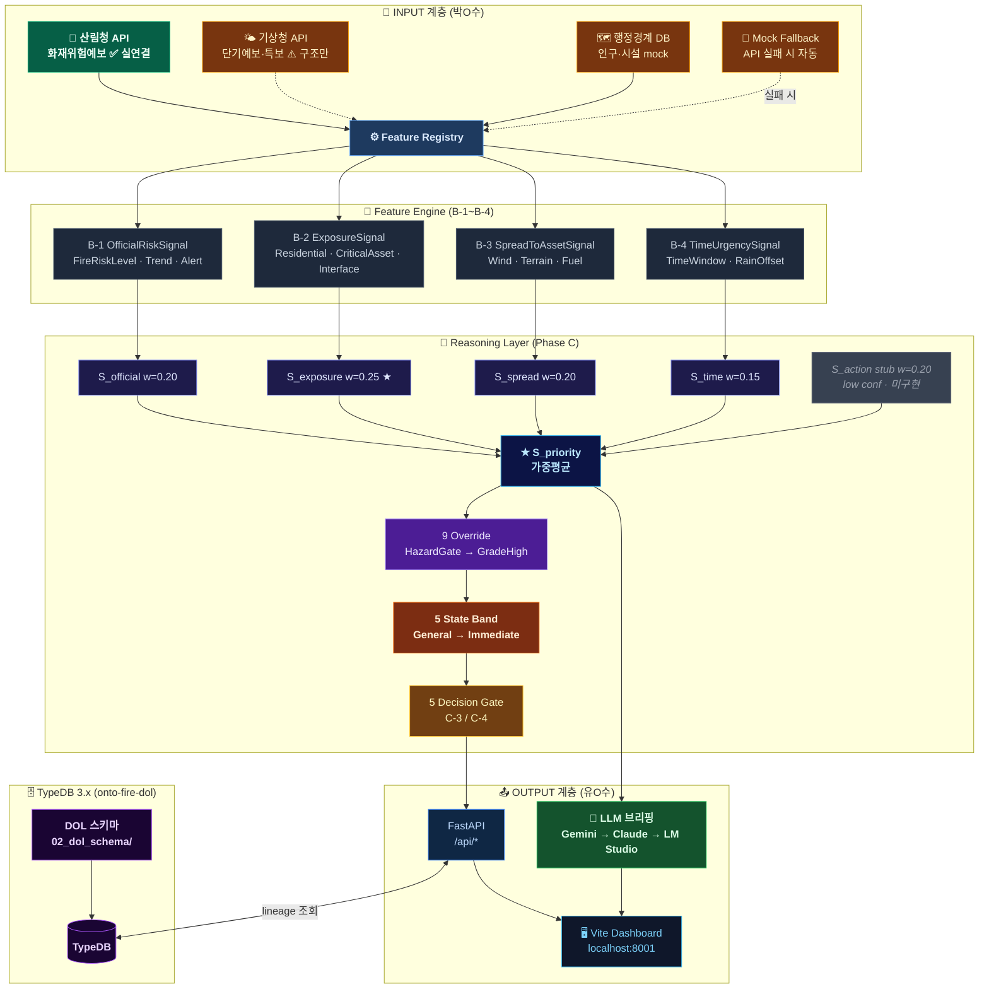

# DOL 추론 엔진 Prototype

> 광주·전남 예비주수 DOL(Decision Operating Layer)을 TypeDB 위에서 추론 엔진으로 구현 + FastAPI 노출 + Vite+Tailwind 대시보드
>
> **현재 상태**: 산림청 실 API 연결 완료 (`mock_input=False`) · Gemini 브리핑 실 API 연결 완료 · SpreadToAsset·TimeUrgency는 mock 유지

**GitHub**: https://github.com/Photometry4040/wildfire-ontology-demo

```bash
git clone https://github.com/Photometry4040/wildfire-ontology-demo.git
```

---

## 빠른 시작

```bash
# 1. TypeDB 서버 기동 (별도 터미널)
typedb server

# 2. DOL 스키마 + 데이터 적재
cd 02_dol_schema && python3 load_dol.py

# 3. FastAPI 서버 시작 (포트 8001)
cd 03_backend && uvicorn app.main:app --port 8001 --reload

# 4a. 브라우저 직접 (프로덕션 빌드 서빙)
open http://localhost:8001

# 4b. 프론트엔드 개발 서버 (HMR)
cd 04_frontend && npm install && npm run dev
# → http://localhost:5174

# 5. Baseline 추론 데모 (별도 접속)
open http://localhost:8001/baseline/
```

---

## 전체 아키텍처 — Mermaid 요약



---

## 추론 파이프라인 — 단계별 상세

```mermaid
flowchart LR
    classDef input   fill:#065f46,stroke:#10b981,color:#ecfdf5,font-weight:bold
    classDef trigger fill:#7f1d1d,stroke:#ef4444,color:#fee2e2,font-weight:bold
    classDef state   fill:#1e3a8a,stroke:#60a5fa,color:#dbeafe,font-weight:bold
    classDef action  fill:#713f12,stroke:#f59e0b,color:#fef3c7,font-weight:bold
    classDef lineage fill:#4c1d95,stroke:#a78bfa,color:#ede9fe,font-weight:bold
    classDef llm     fill:#14532d,stroke:#22c55e,color:#dcfce7,font-weight:bold

    IN[("📡 예측 DB\n박O수")]
    TRG["🚨 ① TRIGGER\n29 Source 임계치 비교"]
    ST["⚙️ ② STATE\n5 Signal 가중평균\nS_priority 산출"]
    ACT["🎯 ③ ACTION\n9 Override + 5 Decision Gate\nConfidence × Mode"]
    LIN["🔍 ④ LINEAGE\nFeature→Signal→State\nAudit 역추적"]
    LLM["💬 ⑤ LLM 변환\nGemini→Claude→LM Studio\n한국어 브리핑"]

    IN -->|"위험지수"| TRG
    TRG -->|"Feature 값"| ST
    ST -->|"S_priority + Override"| ACT
    ACT -->|"결정 체인"| LIN
    LIN -->|"구조화 데이터"| LLM

    class IN input
    class TRG trigger
    class ST state
    class ACT action
    class LIN lineage
    class LLM llm
```



---

## 구현 완료 항목 ✅

### TypeDB DOL 스키마 (`02_dol_schema/`)

| 파일 | 내용 |
|---|---|
| `schema/01_entities.tql` | 시군구·구간 엔티티 |
| `schema/02_features.tql` | Feature 엔티티 정의 |
| `schema/03_signals.tql` | Signal·S_priority 정의 |
| `schema/04_overrides.tql` | Override 결정 엔티티 |
| `data/sources.tql` | 29 Source 구조 |
| `data/prediction.tql` | RF 예측 mock |
| `inference/i01~i03.tql` | Feature→Signal 추론 |
| `load_dol.py` | DB 드롭·재생성·적재 (9 Override 통합 완료) |

---

### Feature Engine (`03_backend/app/services/features/`)

#### B-1: OfficialRiskSignal (3 Features)
```
FireRiskLevelFeature      : 산림청 위험등급    → score [0,1]   confidence=high
FireRiskTrendFeature      : 위험 추세          → score [0,1]   confidence=high
LargeFireRiskAlertFeature : 대형산불경보       → score {0, 0.5, 1.0}
```

#### B-2: ExposureSignal (3 Features)
```
ResidentialExposureFeature : F = 0.40×인구 + 0.20×세대 + 0.15×건물 + 0.25×inv(거리)
CriticalAssetFeature       : 문화재·병원·발전소 가중합
ForestInterfaceFeature     : 산림 접경 길이
```
- 곡성군: `forest_to_residence_distance=150m` → 노출도 최상위

#### B-3: SpreadToAssetSignal (3 Features)
```
WindTowardAssetFeature    : KMA 풍향·풍속 → 자산 방향 성분
TerrainTowardAssetFeature : 정면=1.0 / 사면=0.5 / 외면=0.0
FuelContinuityFeature     : 0.40×연속성 + 0.25×inv(불연속) + 0.35×밀도
```

#### B-4: TimeUrgencySignal (2 Features)
```
HighRiskTimeWindowFeature : max_t(위험도_t) × 긴박도(hours_to_peak)
RainOffsetFeature         : 강수 예보 상쇄 (Signal 층에서 inv() 적용)
```

---

### Reasoning Layer (`03_backend/app/services/reasoning/`)

#### C-1: S_priority 공식
```
S_priority = 0.20·S_official + 0.25·S_exposure + 0.20·S_spread
           + 0.20·S_action   + 0.15·S_time
```

#### C-1: 5 State Band
| S_priority | State Band |
|---|---|
| < 0.20 | GeneralManagement |
| 0.20~0.40 | EnhancedMonitoring |
| 0.40~0.60 | ReviewPreWatering |
| 0.60~0.80 | PriorityPreWatering |
| ≥ 0.80 | ImmediatePreWatering |

#### C-2: 9 Override (우선순위 순) — 단일 소스 통합
> `signals.py::apply_overrides()` 하나로 통합 (TypeDB 경로·Python 경로 동일 로직)

| # | Override | 조건 | 결과 State |
|---|---|---|---|
| 1 | HazardGate | 작업 불가(안전) | NotActionable |
| 2 | AccessGate | 차량 접근 불가 | Deferred |
| 3 | RainGate | RainOffset > 0.6 | MonitorOnly |
| 4 | Recheck | 완료 후 새 위험창 | Recheck |
| 5 | Completed | 완료 후 재진입 없음 | Completed |
| 6 | AlertSevere | 경보 → min PriorityPreWatering | floor 격상 |
| 7 | AlertWarning | 주의보 + S_exposure ≥ 0.5 | floor 격상 |
| 8 | GradeSevere | 매우높음 or RI ≥ 86 | floor 격상 |
| 9 | GradeHigh | 높음 or RI ≥ 66 | floor 격상 |

#### C-3/C-4: 5 Decision Gate × Confidence 매트릭스
| Gate | Trigger | Mode |
|---|---|---|
| SelectPreWateringSegment | State ≥ ReviewPreWatering | advisory_only |
| SchedulePreWatering | Selected + S_time | advisory_only (F_time_lead=low) |
| AssignResourcePackage | Scheduled + actionability | manual_review (2+개 low) |
| DeferOrMonitor | MonitorOnly/NotActionable/Deferred | advisory_only |
| RequestManualReview | mock_input / join실패 / 고위험 | manual_review |

---

### FastAPI 라우터 (`03_backend/app/routes/`)

#### DOL 라우터 (`onto-fire-dol` DB)

| 엔드포인트 | 메서드 | 설명 |
|---|---|---|
| `/api/health` | GET | TypeDB 연결 상태 |
| `/api/segments` | GET | 시군구 목록 + S_priority 내림차순 |
| `/api/segments/raw-signals` | GET | **몬테카를로용** 5개 Signal 원시값 반환 |
| `/api/segments/{id}` | GET | 구간 상세 (Feature·Signal·Override·status_history) |
| `/api/segments/{id}/lineage` | GET | Feature→Signal→State 역추적 |
| `/api/segments/{id}/inference-trace` | GET | 3단계 추론 trace + TypeQL 스니펫 (B-4) |
| `/api/inference/run` | POST | 추론 재실행 (TypeDB 재계산 + 라이브 뷰 자동 연동) |
| `/api/inference/run-with-thresholds` | POST | Signal 가중치 시뮬레이션 (B-3) |
| `/api/briefing/daily` | GET | Gemini 일일 브리핑 (async) |
| `/api/briefing/retrospective/gokseong` | GET | 2025-01-22 곡성 회고 |
| `/api/briefing/priority-ranking` | GET | 우선순위 목록 (LLM 없음) |

#### Baseline 라우터 (`onto-fire` DB — 발표 데모용)

| 엔드포인트 | 메서드 | Phase | 설명 |
|---|---|---|---|
| `/api/baseline/init` | POST | 0 | onto-fire DB 재생성 + 스키마·데이터 로드 |
| `/api/baseline/trigger` | GET | 1 | 고위험 구역 감지 + 기상 조건 |
| `/api/baseline/infer` | POST | 2 | i01~i04 추론 INSERT 순차 실행 |
| `/api/baseline/actions` | GET | 3 | v01~v04 결정 결과 조회 |
| `/api/baseline/lineage` | GET | 4 | 접근통제 결정 근거 역추적 |
| `/api/baseline/pipeline` | POST | 전체 | Phase 0~4 원클릭 실행 |

---

### LLM Integration (`03_backend/app/services/llm/`)

| 파일 | 역할 |
|---|---|
| `gemini_client.py` | Google Gemini 우선 클라이언트 (`gemini-2.5-flash-lite`, asyncio.to_thread) |
| `client.py` | Anthropic Claude fallback (동기) |
| `lm_studio_client.py` | LM Studio 로컬 LLM fallback (OpenAI 호환 API) |
| `briefing.py` | async 브리핑 생성 (Gemini→Claude→LM Studio→텍스트) |
| `prompts.py` | 시스템 프롬프트 + 브리핑·회고 user prompt 템플릿 |

---

### Frontend (`04_frontend/`) — Vite + Tailwind CSS + vis.js

**4-탭 구조 (발표 전 정비 완료):**

```
[ 📊 구간 분석 | 🔄 추론 파이프라인 | 🕸️ 데이터 아키텍처 | 🔥 브리핑 ]
```

| 탭 | 좌측 | 우측 |
|---|---|---|
| 구간 분석 | 구간목록 카드 | 구간 상세 + 함수 추론 3단계 |
| 추론 파이프라인 | 6단계 파이프라인 + 가중치 시뮬레이터 + **4-Phase 라이브 뷰** | — |
| 데이터 아키텍처 | 3계층 구조 | **vis.js 인터랙티브 관계 그래프** |
| 브리핑 | LLM 브리핑 | DOL 8축 메타뷰 |

**모듈 구조:**

```
04_frontend/
├── index.html              # HTML 골격 (4-탭 구조)
├── package.json            # vite + tailwindcss + chart.js
├── vite.config.js
├── tailwind.config.js
├── postcss.config.js
└── src/
    ├── main.js             # 진입점 + 컴포넌트 mount
    ├── api/
    │   ├── client.js       # safeFetch wrapper
    │   ├── segments.js     # loadSegments / loadDetail
    │   ├── briefing.js     # loadBriefing (localStorage 캐시)
    │   └── inference.js    # runInference / runWithThresholds
    ├── components/
    │   ├── pipeline-panel.js    # 6노드 파이프라인 + 4-Phase 라이브 뷰 (baseline API)
    │   ├── layer-stack.js       # 3계층 아키텍처 + 예제 토글
    │   ├── relation-graph.js    # vis.js 인터랙티브 노드-엣지 그래프
    │   ├── briefing-panel.js    # LLM 브리핑 + Top5 카드
    │   ├── segment-list.js      # 구간 목록 sidebar
    │   ├── segment-detail.js    # 구간 상세 + Chart.js
    │   ├── lineage-table.js     # Lineage 역추적 테이블
    │   ├── dol-meta.js          # DOL 8축 카드
    │   ├── state-timeline.js    # State 설명 + Status 타임라인
    │   ├── function-inference.js # 3단계 추론 라이브 뷰
    │   ├── threshold-panel.js   # 가중치 슬라이더 + 몬테카를로 히트맵
    │   ├── mode-switch.js       # 4-탭 전환 로직
    │   └── dol-detail.js        # 8축 상세 오버레이
    ├── state/store.js      # Proxy 기반 reactive store (activeTab 포함)
    ├── styles/
    │   ├── base.css        # body · scrollbar · Tailwind base
    │   └── components.css  # 탭·라이브뷰·히트맵 스타일 포함
    └── utils/
        ├── toast.js        # 단순/멀티 토스트
        └── formatters.js   # STATE_KR, spColor, 상수 맵
```

**UI 컴포넌트 목록:**

| 컴포넌트 | 설명 | 버전 |
|---|---|---|
| 4-탭 UI | 구간분석/파이프라인/아키텍처/브리핑 탭 전환 | 정비 |
| 파이프라인 라이브뷰 | 6노드 순차 점등 (TRIGGER→LLM) | A |
| 3계층 아키텍처 | Raw→Backing→Ontology + 예제 토글 | A |
| **vis.js 관계 그래프** | Segment→Feature→Signal→State 인터랙티브 노드-엣지 | **정비** |
| LLM 브리핑 | Gemini 보고서 + Top5 카드 (localStorage 캐싱) | A |
| 구간 목록·상세 | Feature/Signal Chart.js + Lineage 테이블 | A |
| DOL 8축 메타뷰 | 8개 상태 카드 + 상세 오버레이 | A+B-5 |
| State vs Status | State 설명 카드 + 6단계 타임라인 | B-1 |
| **4-Phase 라이브 뷰** | TRIGGER→STATE→ACTION→LINEAGE 시각화 (baseline API 연동) | **정비** |
| **추론 재실행 통합** | "추론 재실행" 클릭 → 6노드 + 4-Phase 동시 자동 실행 | **정비** |
| 가중치 슬라이더 | 5 Signal 가중치 조정 → Before/After 비교 | B-3 |
| **몬테카를로 히트맵** | S_official×S_exposure 10×10 격자 → 위험도 색상 히트맵 | **정비** |
| 함수 추론 3단계 | calc_features→calc_signals→decide + TypeQL 코드 토글 | B-4 |

---

### Baseline 데모 (`01_baseline/frontend/`)

`demo_pipeline.py`의 터미널 출력을 브라우저 인터랙티브 대시보드로 구현.

접속: **`http://localhost:8001/baseline/`**

| 버튼 | 동작 |
|---|---|
| 🚀 추론 시작 | Phase 0~4 자동 순차 실행 |
| ⏭ 단계별 | 단계 하나씩 클릭 실행 (발표 설명용) |
| 🔄 초기화 | 전체 UI 리셋 |

**Phase별 시각화:**

| Phase | 시각화 | TypeDB |
|---|---|---|
| 0 Init | DB 초기화 상태 배지 | onto-fire DB 재생성 |
| 1 TRIGGER | 구역 카드 3개 (위험지수 게이지 + 기상) | risk-assessment 쿼리 |
| 2 STATE | i01~i04 체크마크 순차 표시 | high_risk_zones() fun 실행 |
| 3 ACTION | 결정 카드 4종 팝업 | v01~v04 verify 쿼리 |
| 4 LINEAGE | 노드 체인 점등 (위험지수→기상→연료수분→결정) | 역추적 JOIN 쿼리 |

---

### 곡성 회고 (`app/services/retrospective/`)
- **시나리오**: 2025-01-21 시점 추론 엔진이 "내일(01-22) 곡성 산불"을 미리 감지했는가?
- **결과**: S_priority=**0.706** → **PriorityPreWatering** · **1위/27** 시군구
- Override: `GradeSevere` (risk_grade=높음, alert_class=주의보)
- 근거: S_spread=0.87 (최대 기여), S_exposure=0.72 (인구 밀집+산림 접경)

---

## 미구현 항목 ⚠️

### S_action — WateringActionability Features (전부 stub)
현재 `S_action = 0.5 (low confidence, mock=True)` 고정.

| Feature # | 이름 | 상태 |
|---|---|---|
| #10 | VehicleAccessFeature (차량 접근성) | ❌ 미구현 |
| #11 | WaterSourceFeature (수원 위치) | ❌ 미구현 |
| #12 | WaterVolumeFeature (수원 용량) | ❌ 미구현 |
| #13 | WorkSafetyFeature (작업 안전성) | ❌ 미구현 |
| #14 | EquipmentFeature (장비 가용성) | ❌ 미구현 |

### TimeUrgency 미구현 Features
| Feature # | 이름 | 영향 |
|---|---|---|
| #15 | DispatchLeadTimeFeature | Gate 2 SchedulePreWatering → 항상 advisory_only |
| #16 | WateringDurationFeature | Gate 3 AssignResourcePackage → manual_review 발동 |

### 실 API 연결 현황

| 파이프라인 | 상태 | 비고 |
|---|---|---|
| 산림청 화재위험예보 API (B-1) | ✅ **실 API 연결 완료** | `.env` `FORESTRY_API_KEY` 설정 시 실 호출, 실패 시 mock 자동 fallback |
| Gemini LLM 브리핑 | ✅ **실 API 연결 완료** | `.env` `GOOGLE_API_KEY` 설정 시 실 호출 |
| 기상청 단기예보 API (B-2~B-4) | ⚠️ 구조만 | 클라이언트 코드 있음, `KMA_API_KEY` 연결 예정 |
| 행정경계 polygon 매칭 | ❌ 미구현 | `pipelines/admin_boundaries/` 빈 폴더 |

#### B-1 산림청 API 연결 방식

```
B-1 Feature 데이터 흐름:
  .env FORESTRY_API_KEY 있음 → FireRiskForecastClient.fetch() → 산림청 실 API
                     없거나 실패 → _build_mock() 자동 fallback (무중단)

mock_input 필드로 구분:
  mock_input=False → 실 API 값
  mock_input=True  → mock fallback 값
```

#### Mock 데이터로 전환하는 방법

```bash
# 방법 1: .env에서 API 키 제거 또는 주석 처리
# FORESTRY_API_KEY=  (빈 값 or 미설정 → 자동 mock)

# 방법 2: Python 코드에서 강제 mock
from pipelines.fire_risk_forecast.client import FireRiskForecastClient
forecasts = await FireRiskForecastClient().fetch(date, force_mock=True)

# 방법 3: registry.py 직접 호출 (테스트용)
from app.services.features.registry import run_all_features_mock
rows = run_all_features_mock()   # 하드코딩 _OFFICIAL_MOCK 배열 사용

# 방법 4: 특정 날짜 시나리오 (곡성 산불 회고용)
# 2025-01-20 ~ 2025-01-23 날짜는 _MOCK_SCENARIO에 정의된 회고 데이터 사용
forecasts = await FireRiskForecastClient().fetch("2025-01-22", force_mock=True)
```

> **참고**: `run_all_features_mock()`은 `_OFFICIAL_MOCK` 배열(하드코딩)을 사용합니다.
> `run_all_features_live()`는 실 API 호출 + 실패 시 `_build_mock(오늘날짜)`로 fallback합니다.
> B-2(ExposureSignal), B-3(SpreadSignal), B-4(TimeUrgency)는 현재 mock 고정입니다.

### 발표 멘트 포인트 (코드 수정 없이 설명)
| 이슈 | 발표 멘트 |
|---|---|
| TypeDB 3구간 vs Python 27시군구 | "TypeDB에는 광주·전남 대표 3개 구간 샘플, Python 추론 엔진은 27개 시군구 전체 처리" |
| TypeDB fun 미구현 | "TypeDB는 구조 저장·조회 담당, 핵심 산술 추론은 Python 엔진이 처리" |
| S_priority TypeDB fun | "compute_s_priority()는 TypeDB 3.x 다중 변수 산술 제약으로 Python 위임" |

---

## 추가하면 좋을 항목 💡

| 항목 | 효과 | 난이도 |
|---|---|---|
| 카카오맵 + 시군구 폴리곤 색상 코딩 | 지역별 위험 직관화 | 중 |
| WebSocket 파이프라인 스트리밍 | 실시간 진행률 (현재는 mock 타이머) | 중 |
| 실 API 자동 수집 스케줄러 (cron) | 일별 실데이터 누적 | 중 |
| TypeQL function으로 S_priority 실시간 추론 | TypeDB 완전 활용 | 고 |
| 시계열 대시보드 (일별 S_priority 추이) | 장기 패턴 발견 | 중 |
| WateringActionability Feature 구현 (5개) | S_action stub 제거 | 고 |
| Anthropic prompt caching (cache_control) | LLM 비용 절감 | 저 |
| 브리핑 PDF 출력 | 보고서 공유 | 저 |

---

## 디렉토리 구조

```
dol-ontology/
├── .env.example                # 환경변수 템플릿 (API 키 목록)
├── README.md                   # 이 파일
├── docs/                       # 원본 설계 문서 (read-only)
│   ├── 04_data-lineage.md
│   ├── 05_feature-contract.md
│   └── 06_decision-logic.md
├── 01_baseline/                # wildfire 온톨로지 기초 데모
│   ├── schema/                 # wildfire_schema.tql + functions.tql
│   ├── data/                   # mock_insert.tql
│   ├── queries/                # q01~q10 CQ 쿼리 + inference/
│   ├── demo_pipeline.py        # 터미널 데모 파이프라인
│   └── frontend/               # 브라우저 4-Phase 라이브 대시보드
│       ├── index.html
│       └── app.js
├── 02_dol_schema/              # TypeDB DOL 스키마
│   ├── schema/                 # 01_entities ~ 04_overrides.tql
│   ├── data/                   # sources.tql, prediction.tql
│   ├── inference/              # i01~i03 추론 쿼리 + v01 lineage
│   └── load_dol.py             # DB 드롭·재생성·적재 스크립트
├── 03_backend/                 # FastAPI 추론 엔진
│   ├── app/
│   │   ├── main.py             # FastAPI 앱 + CORS + /baseline/ 정적 서빙
│   │   ├── models.py           # Pydantic 응답 스키마
│   │   ├── typedb_client.py    # TypeDB 드라이버 singleton
│   │   ├── routes/             # health / segments / inference / briefing / baseline
│   │   └── services/
│   │       ├── features/       # B-1~B-4 Feature Engine (official_risk, exposure, spread, time_urgency)
│   │       ├── reasoning/      # signals.py (S_priority + 9 Override) + decision_gates.py
│   │       ├── reasoning_typedb.py  # TypeDB 서비스 레이어
│   │       ├── llm/            # gemini_client / client(Anthropic) / lm_studio_client / briefing / prompts
│   │       └── retrospective/  # gokseong_2025_01.py 회고 분석
│   ├── tests/                  # pytest (features / signals / overrides / decision_gates)
│   └── requirements.txt
├── 04_frontend/                # Vite + Tailwind 대시보드 (4-탭)
│   ├── index.html              # 4-탭 HTML 골격
│   ├── package.json            # vite · tailwindcss · chart.js · vis.js(CDN)
│   ├── vite.config.js / tailwind.config.js / postcss.config.js
│   └── src/
│       ├── main.js             # 컴포넌트 mount 진입점
│       ├── api/                # client / segments / briefing / inference
│       ├── components/         # 14개 컴포넌트 (pipeline-panel ~ threshold-panel)
│       ├── state/store.js      # Proxy 기반 reactive store
│       ├── styles/             # base.css + components.css
│       └── utils/              # toast.js + formatters.js
├── pipelines/                  # 외부 API 수집 파이프라인
│   ├── fire_risk_forecast/     # 산림청 API (client / cache / transform / regions)
│   ├── kma_weather/            # 기상청 API (client / grids / transform)
│   └── admin_boundaries/       # 행정경계 + 인구 (구조만)
├── harness/                    # 검증 스크립트
│   ├── smoke_test.py
│   ├── schema_validator.py
│   └── api_test.py
└── reports/                    # 곡성 산불 회고 보고서
```

---

## API 엔드포인트 예시

```bash
# 서버 상태
curl http://localhost:8001/api/health

# 시군구 목록 (S_priority 내림차순)
curl http://localhost:8001/api/segments | python3 -m json.tool

# 몬테카를로 히트맵용 Signal 원시값
curl http://localhost:8001/api/segments/raw-signals | python3 -m json.tool

# 곡성군 상세
curl http://localhost:8001/api/segments/SEG-JN-C

# 3단계 추론 trace (B-4)
curl http://localhost:8001/api/segments/SEG-JN-C/inference-trace

# Lineage 역추적
curl http://localhost:8001/api/segments/SEG-JN-C/lineage

# Signal 가중치 시뮬레이션 (B-3)
curl -X POST http://localhost:8001/api/inference/run-with-thresholds \
  -H "Content-Type: application/json" \
  -d '{"weights":{"S_official":0.20,"S_exposure":0.40,"S_spread":0.20,"S_action":0.10,"S_time":0.10}}'

# Baseline 4-Phase 전체 실행
curl -X POST http://localhost:8001/api/baseline/pipeline | python3 -m json.tool

# Baseline Trigger (고위험 구역)
curl http://localhost:8001/api/baseline/trigger | python3 -m json.tool

# Gemini 일일 브리핑
curl "http://localhost:8001/api/briefing/daily?top_n=5"

# 곡성 산불 회고 (2025-01-22)
curl http://localhost:8001/api/briefing/retrospective/gokseong
```

---

## 환경 설정

```bash
# .env (루트)
GOOGLE_API_KEY=...      # Gemini 브리핑 (gemini-2.5-flash-lite)
ANTHROPIC_API_KEY=...   # Claude fallback
FORESTFIRE_API_KEY=...  # 산림청 API (선택, 없으면 mock)
KMA_API_KEY=...         # 기상청 API (선택, 없으면 mock)
```

```bash
# requirements.txt
fastapi>=0.115.0
uvicorn>=0.30.0
typedb-driver==3.10.0
pydantic>=2.7.0
anthropic>=0.100.0
google-genai>=1.0.0
python-dotenv>=1.0.0
httpx>=0.27.0
```

---

## 핵심 수식 요약

```
S_priority = 0.20·S_official + 0.25·S_exposure + 0.20·S_spread
           + 0.20·S_action   + 0.15·S_time

Override 우선순위: HazardGate(1) > AccessGate(2) > RainGate(3) >
                   Recheck(4) > Completed(5) > AlertSevere(6) >
                   AlertWarning(7) > GradeSevere(8) > GradeHigh(9)

Confidence: high(1.00) → medium-high(0.92) → medium(0.85) →
            medium-low(0.70) → low(0.50)
            가용 weight < 80% → 1단계 자동 격하
```

---

## 시연 체크리스트

```bash
# 1. TypeDB 서버 켜기
typedb server

# 2. DOL 스키마·데이터 적재 (최초 1회)
cd 02_dol_schema && python3 load_dol.py

# 3. FastAPI 시작
cd 03_backend && uvicorn app.main:app --port 8001 --reload

# 4. 프론트엔드 빌드 (변경 시)
cd 04_frontend && npm run build

# 5. 전체 검증
python3 harness/smoke_test.py

# 6. DOL 대시보드 — http://localhost:8001
#    ① "추론 파이프라인" 탭 클릭
#    ② "추론 재실행" 클릭
#       → 6노드 파이프라인 애니메이션 + 4-Phase 라이브 뷰 동시 시작
#       → Phase 1: 브라보/찰리 구역 빨간 테두리
#       → Phase 2: i01~i04 체크마크 순차
#       → Phase 3: 결정 카드 4종 팝업
#       → Phase 4: Lineage 노드 체인 점등
#    ③ 가중치 슬라이더 → "🎲 시뮬레이션 히트맵"
#       → S_official × S_exposure 10×10 색상 히트맵 (초록→빨강)
#       → 현재 가중치 위치 흰 원(✦) 표시
#    ④ "데이터 아키텍처" 탭 → 구간 선택 → vis.js 관계 그래프
#    ⑤ "구간 분석" 탭 → SEG-JN-C 선택 → Lineage 역추적 확인

# 7. Baseline 데모 — http://localhost:8001/baseline/
#    ① "🚀 추론 시작" 클릭 → 4 Phase 자동 순차
#    ② "⏭ 단계별" 클릭으로 설명하며 단계별 진행
```
